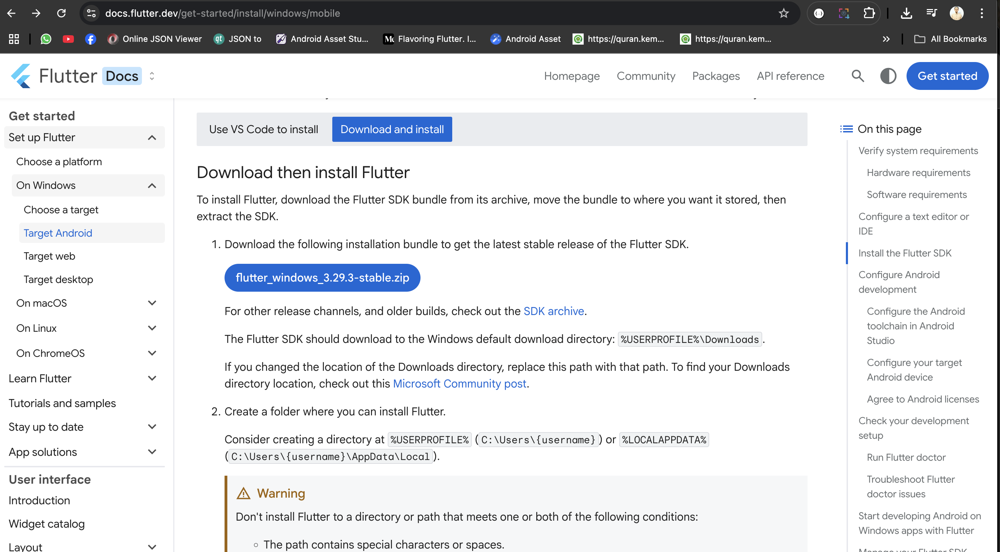
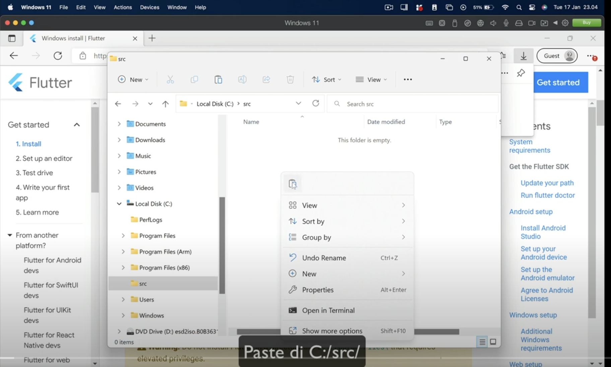
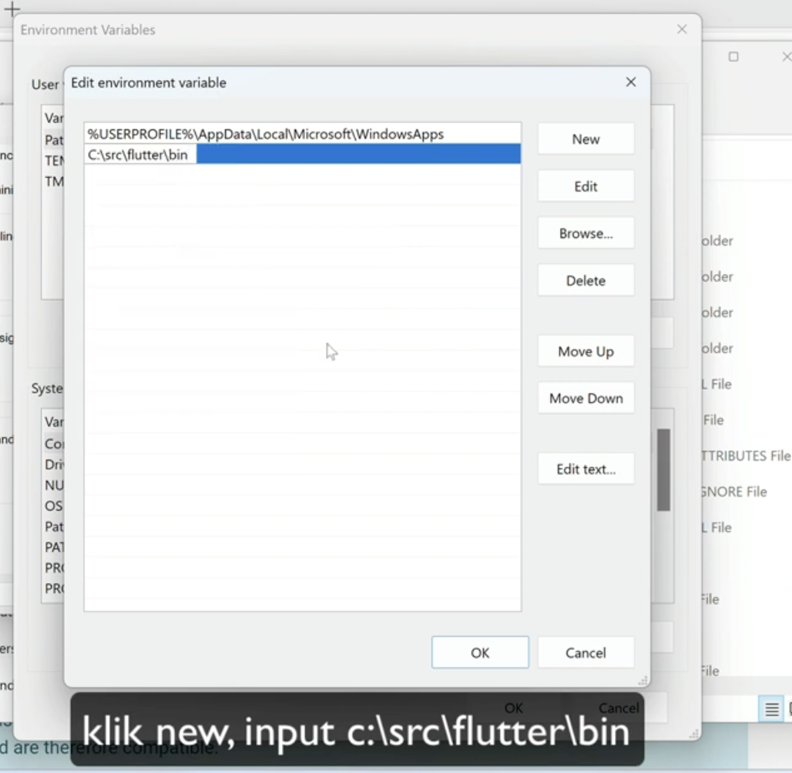
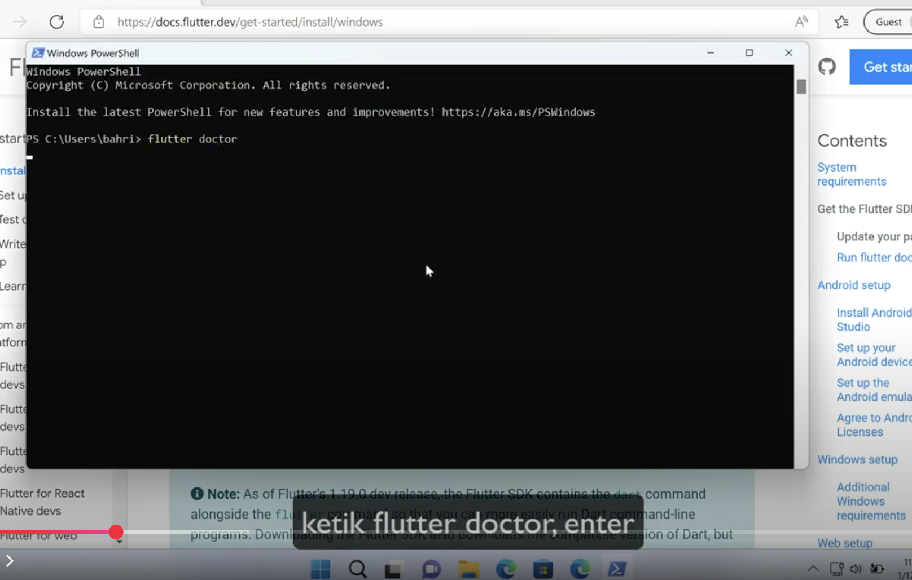
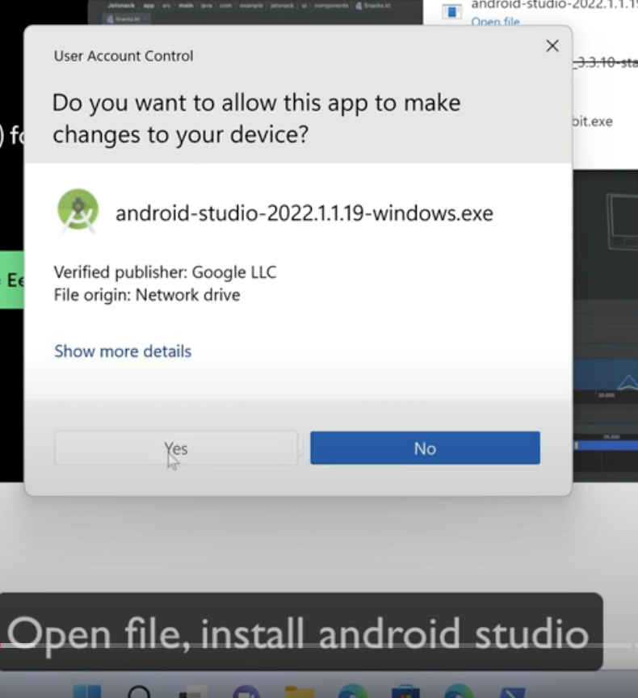
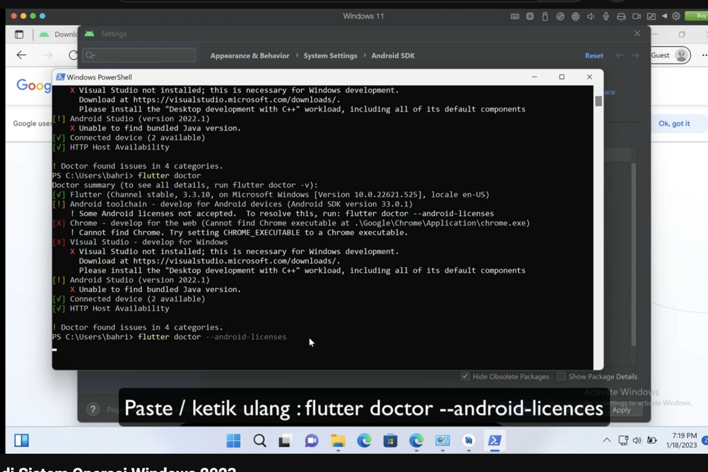
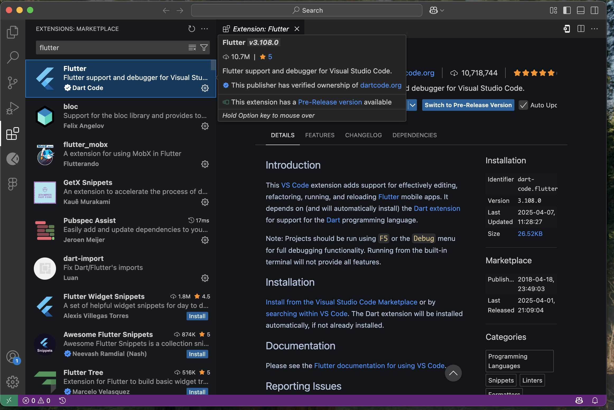
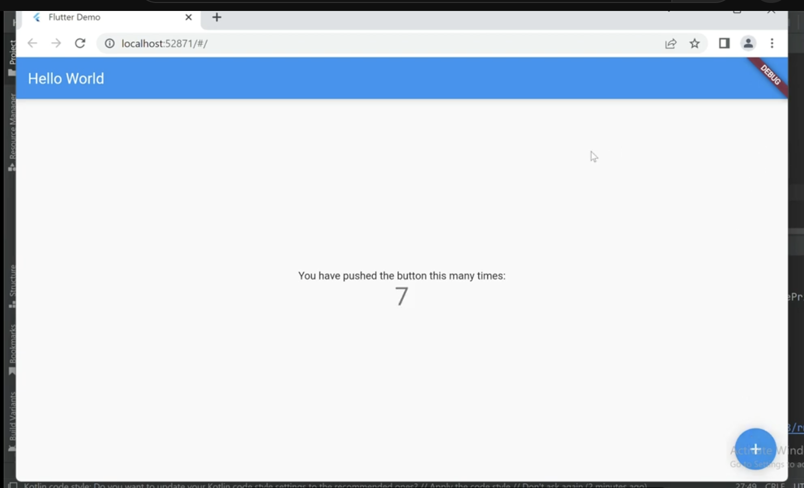

# Flutter Installation Guide for Windows

## System Requirements
- Windows 10 or later (64-bit)
- Minimum 8GB RAM (16GB recommended)
- At least 10GB of free disk space

## Step 1: Download Flutter SDK

1. Visit [flutter.dev](https://flutter.dev)
2. Click "Get Started" then "Windows"
3. Download the latest stable release

## Step 2: Extract Flutter SDK

1. Extract the zip file to your desired location (e.g., `C:\src\flutter`)
2. Do not extract to `C:\Program Files\` (permissions issues)

## Step 3: Add Flutter to PATH

1. Open Start and search for "Environment Variables"
2. Click "Edit the system environment variables"
3. Click "Environment Variables"
4. Under "System variables", find "Path" and click "Edit"
5. Add new entry with path to flutter\bin (e.g., `C:\src\flutter\bin`)

## Step 4: Run flutter doctor

1. Open new command prompt
2. Run `flutter doctor`
3. This will show missing dependencies

## Step 5: Install Android Studio

1. Download Android Studio from [developer.android.com](https://developer.android.com/studio)
2. Run installer with default options
3. Launch Android Studio and complete setup wizard
4. Install Android SDK (required for Flutter)

## Step 6: Accept Android Licenses

1. Run `flutter doctor --android-licenses`
2. Accept all licenses by typing `y` when prompted

## Step 7: Install VS Code (Optional)

1. Install VS Code from [code.visualstudio.com](https://code.visualstudio.com)
2. Install the Flutter and Dart extensions

## Step 8: Create Your First App

1. Run `flutter create myapp`
2. Change directory: `cd myapp`
3. Run app: `flutter run`

## Troubleshooting
- If you get "cmdline-tools component is missing", install it via Android Studio SDK Manager
- For firewall issues, allow Flutter and Dart through your firewall
- if error failed load jvm dll
https://drive.google.com/file/d/191MuWV7BHakmBt7gqyOgk9aqd84U8SwY/view?usp=sharing
